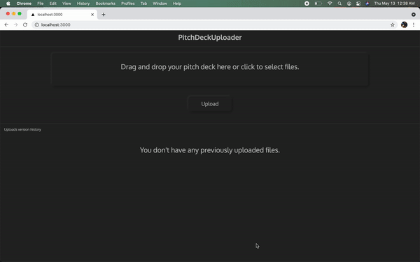

# PitchDeckUploader

PitchDeckUploader is a web application for entrepreneurs to store their startup's pitch deck and maintain it's version history.

## Demo



## Instructions to run locally
  

### Software dependencies

- Node JS
- LibreOffice installed on your local machine. Please install it [here](https://www.libreoffice.org/download/download/). (LibreOffice is required to enable uploading files in PPTX/PPT formats.)
- Browser

### NodeJS dependencies

Install all the NodeJS dependencies
``` bash
npm install
```

### Run in development mode

``` bash
npm run dev
```

Open [http://localhost:3000](http://localhost:3000) with your browser to see the result.

### Run in production mode

Build the project
``` bash
npm run build
```

Run the production build
``` bash
npm run start
```

## Technology stack

- **NextJS** - https://nextjs.org/
- **Supabase** - https://supabase.io/
- **Adobe PDF Embed API** - https://www.adobe.io/apis/documentcloud/dcsdk/pdf-embed.html
- **Libreoffice** - https://www.libreoffice.org/
- **Open source packages and libraries** - 
- - https://www.npmjs.com/package/libreoffice-convert
- - https://github.com/axios/axios
- - https://www.npmjs.com/package/react-dropzone
- - https://github.com/jossmac/react-toast-notifications

